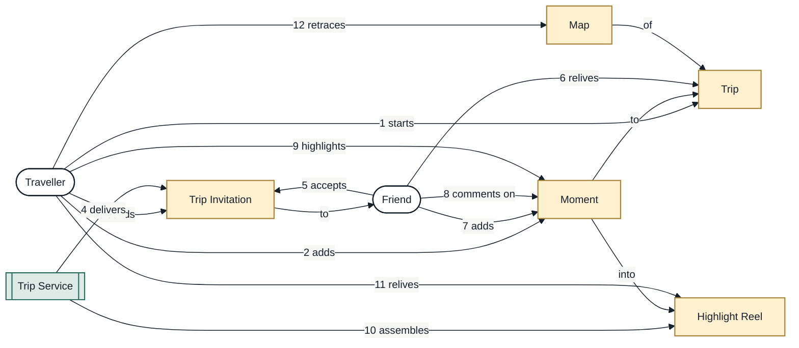

```mermaid
%%{init: {"theme":"base","themeVariables":{
  "fontFamily":"ui-monospace, SFMono-Regular, Menlo, monospace",
  "fontSize":"14px",
  "lineColor":"#16202B",
  "primaryTextColor":"#16202B",
  "edgeLabelBackground":"#F6F7F5"
}}}%%
flowchart LR
  TRV(["Traveller"])
  FRD(["Friend"])
  SVC[["Trip Service"]]

  TRIP["Trip"]
  MOM["Moment"]
  INV["Trip Invitation"]
  REEL["Highlight Reel"]
  MAP["Map"]

  TRV -- "1 starts" --> TRIP
  TRV -- "2 adds" --> MOM
  MOM -- "to" --> TRIP
  TRV -- "3 sends" --> INV
  SVC -- "4 delivers" --> INV
  INV -- "to" --> FRD
  FRD -- "5 accepts" --> INV
  FRD -- "6 relives" --> TRIP
  FRD -- "7 adds" --> MOM
  FRD -- "8 comments on" --> MOM
  TRV -- "9 highlights" --> MOM
  SVC -- "10 assembles" --> REEL
  MOM -- "into" --> REEL
  TRV -- "11 relives" --> REEL
  TRV -- "12 retraces" --> MAP
  MAP -- "of" --> TRIP

  classDef actor  fill:#FFFFFF,stroke:#16202B,stroke-width:1.5px,color:#16202B;
  classDef system fill:#DCEBE6,stroke:#2F6E62,stroke-width:1.5px,color:#16202B;
  classDef object fill:#FFF1CF,stroke:#A8843A,stroke-width:1.5px,color:#16202B;

  class TRV,FRD actor;
  class SVC system;
  class TRIP,MOM,INV,REEL,MAP object;
```
